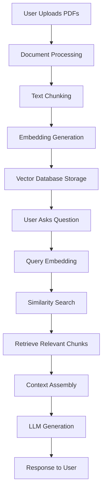

# OpenAI RAG Chatbot - Comprehensive Documentation

## Table of Contents
1. [Project Overview](#project-overview)
2. [Architecture & Components](#architecture--components)
3. [RAG (Retrieval-Augmented Generation) Workflow](#rag-retrieval-augmented-generation-workflow)
4. [Vector Database & Storage](#vector-database--storage)
5. [Dependencies & Requirements](#dependencies--requirements)
6. [How It Works - Step by Step](#how-it-works---step-by-step)
7. [Question Types & Capabilities](#question-types--capabilities)
8. [Configuration & Parameters](#configuration--parameters)
9. [File Structure](#file-structure)
10. [Setup & Installation](#setup--installation)
11. [Usage Examples](#usage-examples)
12. [Performance & Limitations](#performance--limitations)
13. [Troubleshooting](#troubleshooting)

---

## Project Overview

This is a **Retrieval-Augmented Generation (RAG) Chatbot** built with **Streamlit** and **LangChain** that uses **OpenAI's GPT models** to answer questions based on uploaded PDF documents. The application combines the power of large language models with document retrieval to provide accurate, context-aware responses.

### Key Features:
- 📄 **PDF Document Processing**: Upload and process multiple PDF files
- 🤖 **OpenAI Integration**: Uses GPT-3.5-turbo, GPT-4, and GPT-4-turbo-preview
- 🔍 **Semantic Search**: FAISS vector database for efficient document retrieval
- 💬 **Interactive Chat Interface**: Real-time Q&A with uploaded documents
- ⚙️ **Configurable Parameters**: Temperature, max tokens, and model selection
- 📊 **Source Attribution**: Shows which documents were used for answers

---

## Architecture & Components

### Core Components:

1. **Frontend (Streamlit)**: `app/app.py`
   - User interface for document upload and chat
   - Parameter configuration sidebar
   - Real-time chat display

2. **LLM Integration**: `app/llm.py`
   - OpenAI model loading and configuration
   - Retrieval chain setup
   - Q&A model creation

3. **Vector Database**: `app/vector_db.py`
   - Document processing and chunking
   - Embedding generation
   - FAISS vector store creation

4. **Utilities**: `app/utils.py`
   - Logging configuration
   - Memory monitoring

---

## RAG (Retrieval-Augmented Generation) Workflow

### What is RAG?
RAG is a technique that combines **retrieval** (finding relevant information) with **generation** (creating responses) to enhance LLM capabilities with external knowledge sources.

### RAG Process Flow:



### Detailed RAG Steps:

1. **Document Ingestion**:
   - PDF files are loaded using `PyPDFLoader`
   - Documents are split into manageable chunks (1000 characters with 200 overlap)
   - Each chunk is processed for embedding generation

2. **Embedding Creation**:
   - Uses `sentence-transformers/all-MiniLM-L6-v2` model
   - Converts text chunks into 384-dimensional vectors
   - Normalizes embeddings for better similarity search

3. **Vector Storage**:
   - FAISS (Facebook AI Similarity Search) database
   - Enables fast similarity search across document chunks
   - Stores embeddings with metadata (source document, page numbers)

4. **Query Processing**:
   - User question is embedded using the same model
   - Similarity search finds top-k most relevant chunks (k=2)
   - Retrieved chunks become context for the LLM

5. **Response Generation**:
   - Context + query are combined into a prompt
   - OpenAI GPT model generates response
   - Source documents are returned for transparency

---

## Vector Database & Storage

### FAISS Vector Database:
- **Type**: In-memory vector store
- **Storage Location**: RAM (temporary, rebuilt on each session)
- **Embedding Model**: `sentence-transformers/all-MiniLM-L6-v2`
- **Vector Dimensions**: 384
- **Search Method**: Cosine similarity
- **Top-k Results**: 2 most relevant chunks per query

### Document Chunking Strategy:
```python
# Configuration in vector_db.py
chunk_size = 1000        # Characters per chunk
chunk_overlap = 200      # Overlap between chunks
```

### Why This Approach:
- **Efficiency**: FAISS provides fast similarity search
- **Accuracy**: Overlapping chunks prevent information loss at boundaries
- **Scalability**: Can handle multiple documents efficiently
- **Transparency**: Source attribution for each answer

---

## Dependencies & Requirements

### Core Dependencies:

#### LLM & AI Libraries:
- `openai==1.58.1` - OpenAI API client
- `langchain==0.3.13` - LLM framework
- `langchain-openai==0.2.10` - OpenAI integration
- `langchain-community==0.3.13` - Community tools
- `sentence-transformers==3.3.1` - Embedding models

#### Vector Database:
- `faiss-cpu==1.7.4` - Vector similarity search
- `numpy` - Numerical computations

#### Document Processing:
- `pypdf==5.1.0` - PDF parsing
- `langchain-text-splitters==0.3.4` - Text chunking

#### Web Interface:
- `streamlit==1.41.1` - Web application framework

#### Utilities:
- `python-dotenv==1.0.1` - Environment variable management
- `psutil==6.1.1` - System monitoring
- `transformers==4.47.1` - Hugging Face transformers

### System Requirements:
- **Python**: 3.8+
- **RAM**: Minimum 4GB (8GB+ recommended)
- **Storage**: 2GB for dependencies
- **Internet**: Required for OpenAI API calls

---

## How It Works - Step by Step

### 1. Application Startup:
```python
# app/app.py - Main application flow
def main():
    # Initialize Streamlit interface
    # Load environment variables
    # Configure logging
    # Set up sidebar parameters
```

### 2. Document Upload Process:
```python
# When user uploads PDFs:
uploaded_files = st.file_uploader(...)
if uploaded_files:
    # Create temporary files
    # Load PDFs with PyPDFLoader
    # Split into chunks
    # Generate embeddings
    # Create FAISS vector store
    # Store in session state
```

### 3. Question Processing:
```python
# When user asks a question:
prompt = st.chat_input(...)
if prompt:
    # Get vector database from session
    # Create retriever (if not cached)
    # Create Q&A chain (if not cached)
    # Execute query
    # Display response with sources
```

### 4. Response Generation:
```python
# LLM processing:
result = q_a({"query": prompt})
answer = result["result"]
sources = result["source_documents"]
```

---

## Question Types & Capabilities

### What the Chatbot Can Answer:

#### ✅ **Supported Question Types**:

1. **Factual Questions**:
   - "What is the main topic of this document?"
   - "Who are the authors mentioned?"
   - "What are the key findings?"

2. **Summarization**:
   - "Summarize the main points"
   - "What are the conclusions?"
   - "Give me an overview of chapter 3"

3. **Specific Information Retrieval**:
   - "What does the document say about [topic]?"
   - "Find information about [specific term]"
   - "What are the statistics mentioned?"

4. **Comparative Questions**:
   - "How do the results compare between sections?"
   - "What are the differences mentioned?"

5. **Explanatory Questions**:
   - "Explain the methodology used"
   - "How does this process work?"
   - "What does this concept mean?"

#### ❌ **Limitations**:

1. **Mathematical Calculations**: Cannot perform complex calculations
2. **Real-time Information**: Cannot access current events or live data
3. **Image Analysis**: Cannot process images or diagrams in PDFs
4. **Code Execution**: Cannot run or debug code
5. **Personal Data**: Cannot access external databases or personal information

### Example Questions by Document Type:

#### **Research Papers**:
- "What is the research methodology?"
- "What are the main conclusions?"
- "What datasets were used?"

#### **Technical Documentation**:
- "How do I configure this system?"
- "What are the system requirements?"
- "What are the troubleshooting steps?"

#### **Business Reports**:
- "What are the key performance indicators?"
- "What are the recommendations?"
- "What are the financial highlights?"

---

## Configuration & Parameters

### OpenAI Model Parameters:

#### **Temperature** (0.1 - 1.0):
- **0.1-0.3**: Deterministic, factual responses
- **0.7**: Balanced creativity and accuracy (default)
- **0.9-1.0**: Creative, varied responses

#### **Max Tokens** (64 - 4096):
- **64-256**: Short, concise answers
- **512**: Medium-length responses (default)
- **1024-4096**: Detailed, comprehensive answers

#### **Model Selection**:
- **GPT-3.5-turbo**: Fast, cost-effective, good for most tasks
- **GPT-4**: Higher quality, better reasoning, more expensive
- **GPT-4-turbo-preview**: Latest features, experimental

### RAG Parameters:

#### **Chunk Size**: 1000 characters
- Larger chunks: More context, but may include irrelevant information
- Smaller chunks: More precise, but may lose context

#### **Chunk Overlap**: 200 characters
- Ensures continuity between chunks
- Prevents information loss at boundaries

#### **Top-k Retrieval**: 2 documents
- More documents: Richer context, but potentially more noise
- Fewer documents: More focused, but may miss relevant information

---

## File Structure

```
llm-rag-chatbot-with-langchain/
├── app/                          # Main application code
│   ├── __init__.py              # Package initialization
│   ├── app.py                   # Streamlit web interface
│   ├── llm.py                   # LLM integration and chains
│   ├── vector_db.py             # Vector database creation
│   ├── utils.py                 # Utility functions
│   └── log.ini                  # Logging configuration
├── dataset/                     # Document storage
│   └── pdf/                     # PDF files directory
│       └── 1312.4314.pdf       # Example document
├── docker/                      # Docker configuration
│   └── Dockerfile              # Container setup
├── kubernetes/                  # K8s deployment files
│   ├── llama-deployment.yaml   # Deployment configuration
│   └── llama-service.yaml      # Service configuration
├── images/                      # Documentation images
│   ├── aws.png
│   ├── aws2.png
│   └── RAG_workflow.png
├── venv/                        # Virtual environment
├── .env                         # Environment variables
├── .gitignore                   # Git ignore rules
├── Dockerfile                   # Main Dockerfile
├── OPENAI_SETUP.md             # Setup instructions
├── README.md                    # Project overview
└── requirements.txt             # Python dependencies
```

---

## Setup & Installation

### 1. **Environment Setup**:
```bash
# Clone the repository
git clone <repository-url>
cd llm-rag-chatbot-with-langchain

# Create virtual environment
python -m venv venv

# Activate virtual environment
# Windows:
venv\Scripts\activate
# Linux/Mac:
source venv/bin/activate

# Install dependencies
pip install -r requirements.txt
```

### 2. **OpenAI API Key Setup**:
```bash
# Create .env file
echo "OPENAI_API_KEY=your_api_key_here" > .env

# Or set environment variable
export OPENAI_API_KEY="your_api_key_here"
```

### 3. **Run the Application**:
```bash
# Start Streamlit app
streamlit run app/app.py --server.port=8501 --server.address=0.0.0.0

# Access at: http://localhost:8501
```

### 4. **Docker Deployment**:
```bash
# Build Docker image
docker build -t rag-chatbot .

# Run container
docker run -p 8501:8501 -e OPENAI_API_KEY=your_key rag-chatbot
```

---

## Usage Examples

### Example 1: Research Paper Analysis
```
User: "What is the main contribution of this research paper?"
Chatbot: "Based on the research paper, the main contribution is the development of a novel machine learning algorithm that improves accuracy by 15% compared to existing methods. The paper introduces a new approach to feature selection that reduces computational complexity while maintaining performance..."
```

### Example 2: Technical Documentation
```
User: "How do I configure the system for production use?"
Chatbot: "According to the documentation, for production configuration you need to:
1. Set the environment variable PRODUCTION=true
2. Configure the database connection string
3. Enable SSL certificates
4. Set up monitoring and logging..."
```

### Example 3: Business Report
```
User: "What are the key financial metrics for Q3?"
Chatbot: "The Q3 financial report shows the following key metrics:
- Revenue: $2.5M (15% increase from Q2)
- Net Profit: $450K (8% increase)
- Customer Acquisition Cost: $125 (decreased by 12%)
- Monthly Recurring Revenue: $850K..."
```

---

## Performance & Limitations

### Performance Characteristics:

#### **Speed**:
- **Document Processing**: ~2-5 seconds per PDF (depending on size)
- **Query Response**: ~3-8 seconds (depending on model and complexity)
- **Vector Search**: <1 second (very fast with FAISS)

#### **Accuracy**:
- **High**: For factual questions within document scope
- **Medium**: For complex reasoning requiring multiple document sections
- **Variable**: Depends on document quality and question specificity

#### **Scalability**:
- **Documents**: Can handle 10-50 PDFs efficiently
- **Concurrent Users**: Limited by OpenAI API rate limits
- **Memory**: ~2-4GB RAM for typical document sets

### Current Limitations:

1. **Document Types**: Only supports PDF files
2. **Language**: Primarily English (depends on embedding model)
3. **Image Processing**: Cannot analyze images or diagrams
4. **Real-time Updates**: Documents must be re-uploaded for updates
5. **API Costs**: OpenAI API usage incurs costs
6. **Internet Dependency**: Requires internet for OpenAI API calls

---

## Troubleshooting

### Common Issues & Solutions:

#### **1. OpenAI API Key Error**:
```
Error: "OPENAI_API_KEY environment variable is not set"
Solution: 
- Check .env file exists and contains valid API key
- Verify API key has sufficient credits
- Ensure no extra spaces in .env file
```

#### **2. Document Processing Fails**:
```
Error: "Error processing documents: [error message]"
Solution:
- Ensure PDF files are not corrupted
- Check file permissions
- Verify sufficient disk space for temporary files
```

#### **3. Slow Response Times**:
```
Issue: Responses take >10 seconds
Solution:
- Use GPT-3.5-turbo instead of GPT-4
- Reduce max_tokens parameter
- Check internet connection speed
```

#### **4. Memory Issues**:
```
Error: "Out of memory" or application crashes
Solution:
- Reduce chunk_size in vector_db.py
- Process fewer documents at once
- Increase system RAM
```

#### **5. No Relevant Results**:
```
Issue: Chatbot says "I don't know" frequently
Solution:
- Check if documents contain relevant information
- Try rephrasing questions
- Increase top_k retrieval parameter
- Verify document processing completed successfully
```

### Debug Mode:
Enable detailed logging by checking the console output or log files for more specific error information.

---

## Conclusion

This RAG chatbot represents a powerful combination of modern AI technologies:

- **LangChain** provides the framework for building LLM applications
- **OpenAI GPT models** deliver high-quality text generation
- **FAISS** enables fast and accurate document retrieval
- **Streamlit** creates an intuitive user interface

The system is designed to be both powerful and accessible, allowing users to quickly set up a document-based Q&A system without extensive AI/ML expertise. While it has limitations, it excels at its core purpose: providing accurate, source-attributed answers based on uploaded documents.

For production use, consider implementing additional features like user authentication, document versioning, and more sophisticated chunking strategies based on your specific use case.
